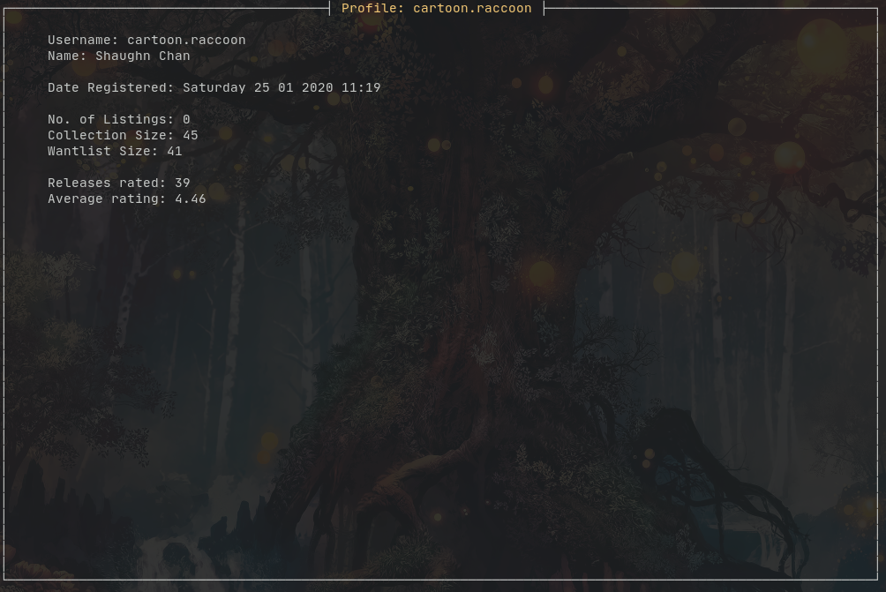
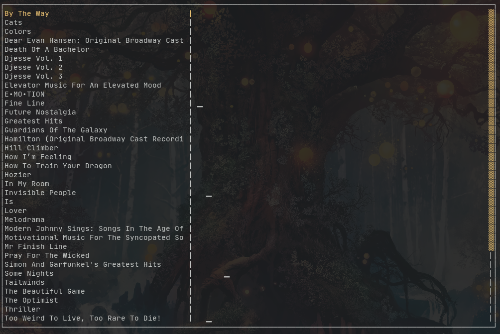

# cogsy
### a curses-based, command line local Discogs client written in Rust


 

## About
Cogsy is a curses-based command line app for tracking your Discogs collection. It queries the Discogs API and allows you to view that information offline, without the need for a browser. It also adds additional features such as tracking your listening history, and displaying it nicely for you.

For the uninformed, [Discogs](https://www.discogs.com) is a website/marketplace where music enthusiasts can collect and sell physical music media such as vinyl records and CDs.

**The final capabilities of this app are:**
- Query the Discogs database using a user's username and app token. (OAuth integration is expected, but not a priority.)
- Store the data in a database and display it in a TUI when the app is started.
- Log user's listening history, and display it when needed.

Cogsy's target audience is admittedly, not very large. It is targeted at people who use their computer's terminal on a daily basis, _and_ are also music enthusiasts with a vinyl/CD collection. That being said, if you don't fit into the above demographic, but this app still appeals to you, do give it a try!

**Note: This app cannot make changes to the user's collection or make purchases, and there are no plans to support this. This will all have to be done on Discogs itself.**

## Requirements
- `cargo` v1.46.0 or later (The official Rust build tool and package manager)
- `rustc` v1.46.0 or later (The official Rust compiler)
- `gcc` v10 or later (For linking, `rustc` does not do linking by itself)
- A Discogs account (obviously)
### The following C shared libraries are needed:
- `libsqlite-dev` or its equivalent for your distro.
- `openssl` (Should already exist)
- `ncurses`

Most installation errors stem from the linker not being able to find the corresponding `.so` file on your system. Look for the missing package and install its `dev` version. This should fix most errors.

You can install everything using the `rustup` toolchain manager, instructions available from the official Rust [install page](https://www.rust-lang.org/tools/install). 

For Linux users, it is recommended you install `rustup` from your distro's repos. This especially applies to Arch Linux users, as Rust AUR packages are compiled using the Arch-packaged version of Rust. `makepkg` won't detect Cargo installed via the official channel.

For Arch Linux users:
```
pacman -S rustup
rustup default stable/nightly
```
Read the Arch Wiki article on Rust for more information.

## Installation
**macOS, Windows, and Linux**

Cogsy is currently broken on Windows 10, due to an ncurses dependency. This bug is being worked on right now. Windows users could get around this problem by running it on Cygwin or WSL, but I don't have a way to test this yet.

_The stable toolchain will compile Cogsy, but in the past some dependencies have used nightly-only features and resulting in errors when compiling on stable. Thus, I recommend you use the nightly toolchain by default._

To switch to the nightly toolchain, run:

`rustup default nightly`

Cogsy can be installed from crates.io, the official Rust package registry:

`cargo install cogsy`

To build from source:
```
git clone https://github.com/cartoon-raccoon/cogsy
cd cogsy
cargo run
```

If anyone is willing to package the app for their own distro, please let me know and then go ahead.

This app has been tested on Arch Linux, Void Linux, Pop!-OS and Fedora. Testing for MacOS and Windows is underway.

_Note: Cogsy is still very much in development and is still considered unstable. It will only enter 1.0.0 when it works on all three target OSes._

## Setup
The app requires some setup: To access the Discogs API, it requires a user token. To obtain this token, go to your Discogs account settings > Developers > Generate new token. Copy the generated string to your clipboard.

On first time startup, the app will query you for your user credentials: Your username, your token and your timezone. To paste the token into the terminal, you may need to use Ctrl-Shift-V instead of Ctrl-V. Once this information has been entered, the app will pull your information from Discogs and start up.

After first time startup, a config.toml file will be created and can be found at:

**Windows:**
`C:\Users\username\AppData\Roaming\cartoon-raccoon\cogsy\config.toml`

**MacOS:**
`/Users/username/Library/Application Support/rs.cartoon-raccoon.cogsy/config.toml`

**Linux:**
`/home/username/.config/cogsy/config.toml`

The config file contains the information you entered during first time startup.

Note: The Discogs API supports OAuth2, and OAuth2 integration for the app is being considered, but it's not a top priority at the moment, and I felt like it doesn't fit the spirit of a small command-line app like this to use such a framework. For now, you will have to use your user token.

## Usage
_Multithreading has been implemented for Cogsy! It will now concurrently pull the contents of each folder. See the notes below for more info._

Cogsy can be run as a TUI text-based interface or as a command line app, depending on what arguments you pass it.

Cogsy as an app with a user interface, has 4 main screens:
1. **Collection**: 
This is the main screen that pops up when you start Cogsy. On the left are the folders in your collection, on the right are the contents of each folder. Pressing Enter on a selected album will bring up a screen with the album's information. This is also where you access the command line, which can be activated by pressing `:`. You can return to this screen from anywhere in the app by pressing 1.

2. **Wantlist**: Pull this up by pressing 2. This displays the contents of your wantlist. Pressing Enter will pull up a screen displaying information on the selected album, and you can press Backspace to go back to the list.

3. **Profile**: Your user profile. Pull this up by pressing 3.

4. **Listen Graph**: This displays your listening history. Pull this up by pressing 4. Each block represents one day, and the size of each block reflects how many times you listened to that album in that day. To see your listening history as discrete entries, you can pull up that screen by pressing `h`.


**The Command Line**

This is Cogsy's heart. All of Cogsy's features are run from here. Vim users will find this familiar, as you activate it by pressing `:`. From here, you can run Cogsy's core commands. At any time, you can cancel a command by pressing Esc.

Cogsy has four core commands:
- `update`: Pulls collection info from Discogs and updates the entire app database.
- `listen [album]`: Cogsy's core feature. Pass it an album name and it will log the album title and the current time as a listening session.
- `query [album]`: Query the local database for information on an album. Use the `-w` or `--wantlist` switch to query the wantlist, otherwise it defaults to querying the collection.
- `random`: Use this when you can't decide what to play. It also logs the selected album as a listening session, unless you pass it the `-n`/`--nolog` switch.

Cogsy can also be run as a terminal app, by passing it one of its core commands. Running Cogsy without any arguments will bring up the user interface.

For example, `cogsy update` will cause Cogsy to update its database and exit. `cogsy query [albumname]` will cause Cogsy to display all the matches for `[albumname]` and exit.

Read the notes file for more information on the app, what it can do and how to use it. This part of the readme is still a WIP, and a wiki is in the works.

**Important Note:** The Discogs API limits HTTP requests to 60 per minute, and gives up to maximum 100 albums per (paginated) request. Users with extremely large collections (>5000 albums) will see extremely long download times, and the app itself may become unusable. In addition, the pagination of the responses means that pulling all the items in a folder concurrently is not possible. Multithreading is only implemented on a per-folder basis, and only users with a large amount of folders will see any improvement in their update times.

## Issues and Bugs
- **When running `update`, the app freezes up**
    - This is normal behaviour. Cogsy uses a blocking API to query Discogs, which means the entire app is put on pause while the update process is running.
Async behaviour is expected to be implemented in a future update.
- **Large collections may slow the app down fairly noticeably**
    - The computation for displaying the data to the screen is done lazily, i.e. everything is loaded from the database and processed only when the command is invoked. Nothing is pre-computed and cached beforehand. Working on implementing this now.

If there are any other bugs, please raise an issue and I will do my best to respond and fix it.

## Future Additions
- OAuth2 integration, eliminating the need for a user token.
- Adding a `price` command, allowing the user to set the price they paid for the album, and also a screen to display the increasing amount of money they spend on their music collection as a sparkview graph. The code to parse the command is already written, all that's left is to implement it.
- An option to read user collection data from a CSV file (Discogs supports downloading collection data as CSV). This would prove to be useful for users with larger collections.
- A popup in Listening history that shows the history for the album only.

## Credits
[gyscos](https://github.com/gyscos) for the Cursive library that the user interface is built on. Thank you for this amazing crate, and for your assistance on Reddit.

Cogsy was heavily inspired by [dijo](https://github.com/NerdyPepper/dijo) by NerdyPepper. It was this project that inspired me to learn Rust in the first place, and this is the first major project I've built, not just in Rust, but ever. This entire project owes its existence to him. Thank you sir.
