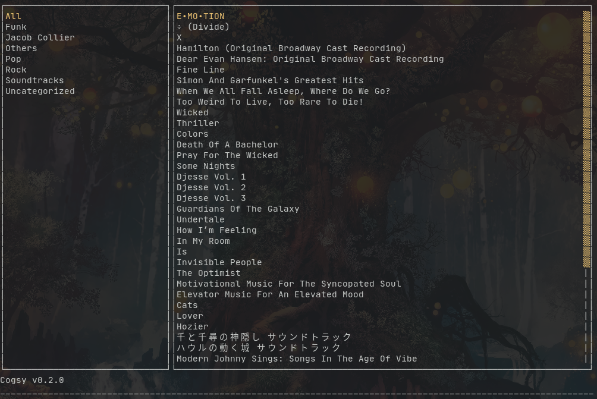
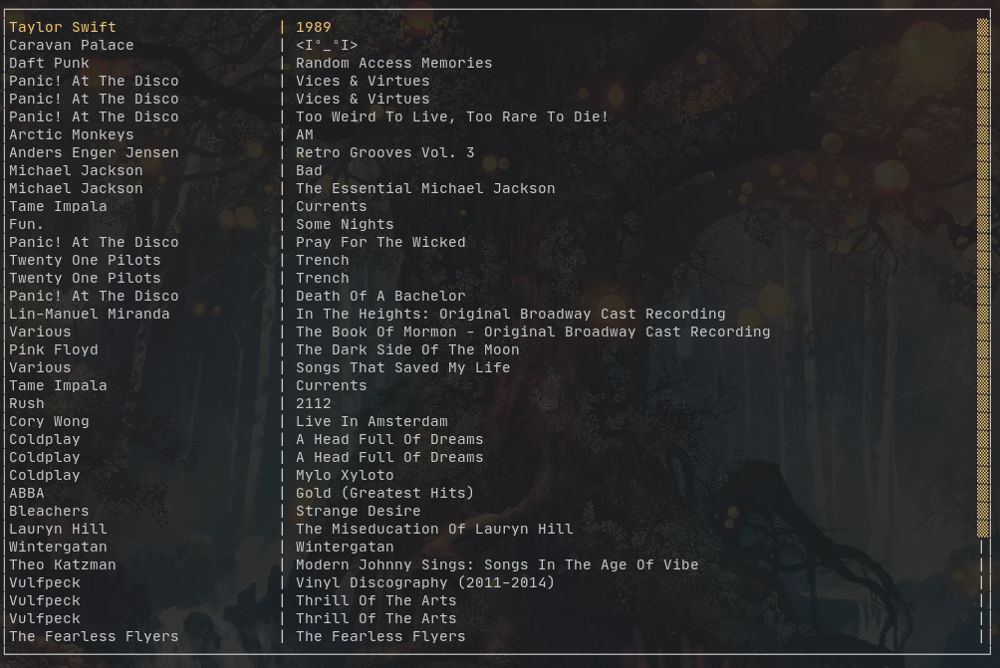
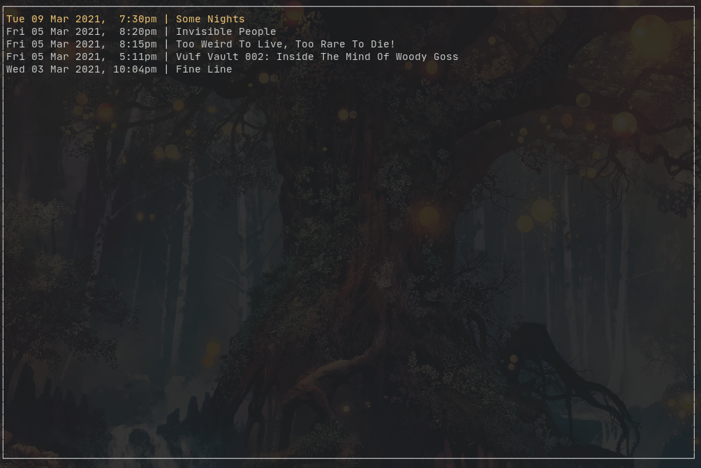

# Cogsy usage and config

## Configuration

On first install, your new config.toml file will look something like this:

```text
[user]
username = cartoon-raccoon
token = <token>
timezone = 8.0
```

You can add an additional `appearance` section with the following fields (containing their default values):

```text
[appearance]
format = "{artist} - {title}"
folders_width = 30
selectcol = "yellow"
messagecol = { default = "white", error = "red", success = "green", hint = "yellow" }
titlecol = "yellow"
commandcol = "white"

```

`format` is the format taken by the text displayed in the collection screen. Album attributes are enclosed in curly brackets and will be expanded into the album attributes when displayed; everything else will be displayed as is.

`folders_width` is the width of the folders element (left side) in the main view.

`selectcol` is the colour of the text selected.

`messagecol` contains the colours of the text that appears in the message box.

`titlecol` is the title of pop up screens such as album info.

`commandcol` is the colour of the command line.

The possible values are the eight tty colours, or:

- black
- red
- green
- yellow
- blue
- magenta
- cyan
- white

To use their bright variants, prepend the colour with "br" (e.g. "bryellow"). This is not supported by the native Linux TTY, but is supported by almost all terminal emulators.

## Usage

_What's New?_

- Ok and History buttons on the album info page
- The quit command
- Even More Colour Customization

Cogsy can be run as a TUI text-based interface or as a command line app, depending on what arguments you pass it. You can quit the user interface by pressing `q` or issuing the `quit` command.

Cogsy as an app with a user interface, has 4 main screens:

1. **Collection**:
This is the main screen that pops up when you start Cogsy. On the left are the folders in your collection, on the right are the contents of each folder. Pressing Enter on a selected album will bring up a screen with the album's information. This is also where you access the command line, which can be activated by pressing `:`. You can return to this screen from anywhere in the app by pressing 1.

_Release Info Page_

This the release info page. It contains more detailed information on the release, such as release year, artist name, format, etc. At the bottom right there are three buttons: Ok, History and Listen.

- `Ok` takes you back to the main page.
- `History` displays the listening history for that album only.
- `Listen` logs a listening session and takes you back to the main screen.

2. **Wantlist**: Pull this up by pressing 2. This displays the contents of your wantlist. Pressing Enter will pull up a screen displaying information on the selected album, and you can press Backspace to go back to the list.

3. **Profile**: Your user profile. Pull this up by pressing 3.

4. **Listen Graph**: This displays your listening history. Pull this up by pressing 4. Each block represents one day, and the size of each block reflects how many times you listened to that album in that day.

To display history as a list of discrete entries, press `h`.

_The history entries are quite sparse as I haven't had time to populate them._

**The Command Line**

This is Cogsy's heart. All of Cogsy's features are run from here. Vim users will find this familiar, as you activate it by pressing `:`. From here, you can run Cogsy's core commands. At any time, you can cancel a command by pressing Esc.

Cogsy has four core commands:

- `update`: Pulls collection info from Discogs and updates the entire app database. There are also the `-u` and `-t` switches for updating the username and token respectively, but they don't do anything at the moment. The `-v` switch displays verbose output when run without the TUI.
- `listen [album]`: Cogsy's core feature. Pass it an album name and it will log the album title and the current time as a listening session.
- `query [album]`: Query the local database for information on an album. Use the `-w` or `--wantlist` switch to query the wantlist, otherwise it defaults to querying the collection.
- `random`: Use this when you can't decide what to play. It also logs the selected album as a listening session, unless you pass it the `-n`/`--nolog` switch.

Cogsy can also be run as a terminal app, by passing it one of its core commands. Running Cogsy without any arguments will bring up the user interface.

For example, `cogsy update` will cause Cogsy to update its database and exit. `cogsy query [albumname]` will cause Cogsy to display all the matches for `[albumname]` and exit.

Cogsy also has the `database` command, only accessible as a subcommand from the shell. This command enables the user to administrate the database. There are three options for the `database` command:

- `--reset`: This purges the database and retrieves new data from Discogs. Note that this will also remove your listening history.
- `--orphan`: This performs orphan table removal.
- `--check`: This performs the database integrity check.

Read the notes file for more information on the app, what it can do and how to use it.

## Internals
Cogsy stores all its data at (on Linux) `~/.local/share/cogsy/cogsy_data.db`.
This is a simple sqlite3 database and can be browsed with the sqlite3 browser program.

On startup, Cogsy does a database check for the required folders. If the test does not pass (the required tables are absent), it exits with a database error.

In order to keep track of user-defined folders, Cogsy uses a table called `folders` to store folders and their names, and uses this table to access the database tables for each folder. Thus, it is possible to have orphan tables - tables that exist in the database but don't have an entry in the `folders` table, and therefore are not valid user folders to Cogsy. This is detected by the database check on startup, and the relevant error message is shown. To remove orphan tables, you can run `cogsy database --orphan`. Alternatively, you can manually delete the orphan tables inside the sqlite3 browser with `drop table <folder name>;`.

**Important Note on Updating:** The Discogs API limits HTTP requests to 60 per minute, and gives up to maximum 100 albums per (paginated) request. Users with extremely large collections (>5000 albums) will see extremely long download times, and the app itself may become unusable. In addition, the pagination of the responses means that pulling all the items in a folder concurrently is not yet possible. Multithreading is only implemented on a per-folder basis, and only users with a large amount of folders will see any improvement in their update times.

However, it might be possible to work out the URL of each page in advance and pull the info concurrently that way, but the app is still subject to Discogs' rate limiting and this would just make Cogsy hit the request limit faster. Users with extremely large collections will still see a performance hit.

This algorithm may be possible to implement, and may appear in a future release.
